# Тестування працездатності системи

## Запуск серверу

```bash
cd ./src/scripts
node app.js
```

## Перевірка працездатності сервісів

### Список запитів

- `POST /api/user` - Створити користувача
- `GET /api/user` - Отримати усіх користувачів
- `GET /api/user/{id}` - Отримати інформацію про конкретного користувача
- `GET /api/user/{id}/project` - Отримати список ID проектів, створених користувачем
- `PUT /api/user/{id}` - Оновити дані користувача
- `DELETE /api/user/{id}` - Видалити користувача

- `POST /api/project` - Створити проект
- `GET /api/project` - Отримати усі проекти
- `GET /api/project/{id}` - Отримати інформацію про конкретний проект
- `PUT /api/project/{id}` - Змінити назву проекту
- `DELETE /api/project{id}` - Видалити проект

### Створити користувача

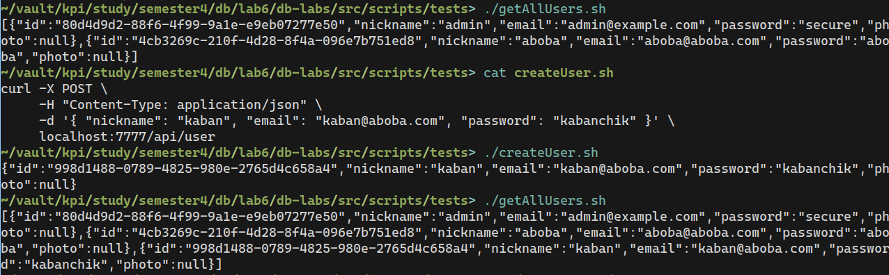

### Отримати усіх користувачів

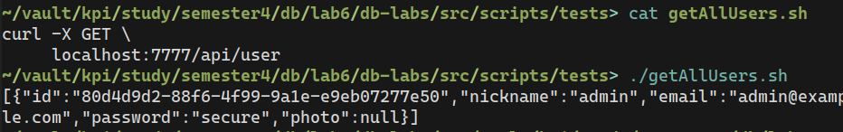

### Отримати інформацію про конкретного користувача

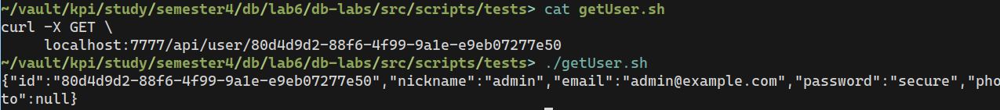

### Отримати список ID проектів, створених користувачем

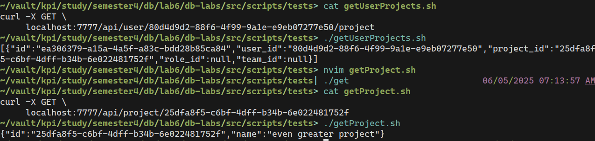

### Оновити дані користувача

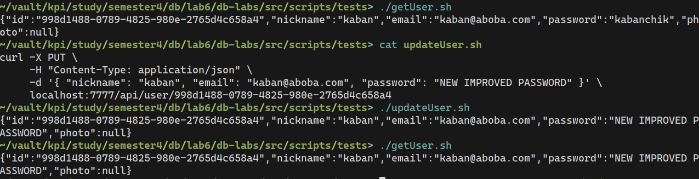

### Видалити користувача

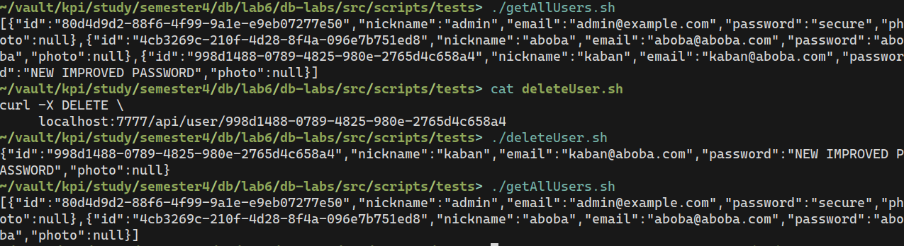

### Створити проект

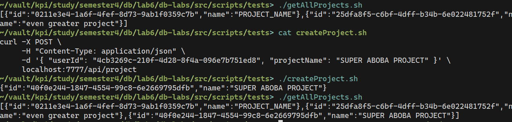

### Отримати усі проекти

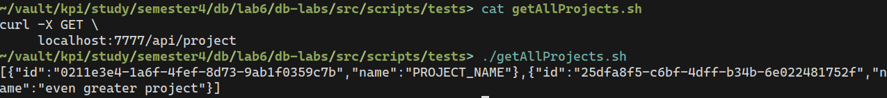

### Отримати інформацію про конкретний проект

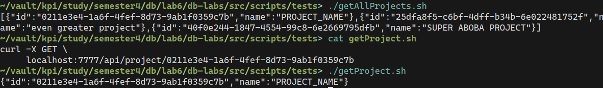

### Змінити назву проекту

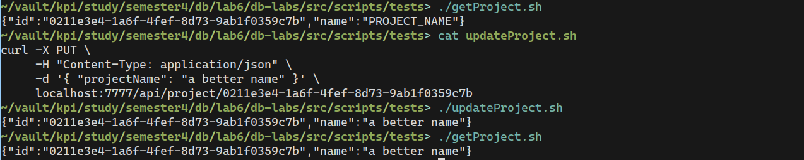

### Видалити проект

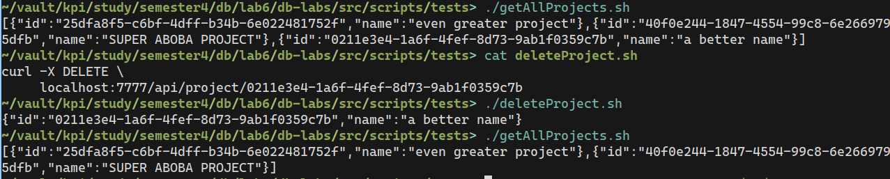
